# Filament Onboarding

[](https://packagist.org/packages/wallacemartinss/filament-onboarding)
[](https://github.com/wallacemartinss/filament-onboarding/actions/workflows/tests.yml)
[](https://packagist.org/packages/wallacemartinss/filament-onboarding)

Database-driven onboarding for Filament v5: a progress checklist that follows the user across every page of the panel, guided spotlight tours, and steps that complete themselves — by a condition your app registers, by reaching a page, or by watching a video.

Journeys are authored **in the panel, not in code**, so product people can rewrite them without a deploy. And steps bound to a **condition** catch up on their own, which means **users who signed up long before the journey existed enter it already half-done** instead of being told to do things they did years ago.

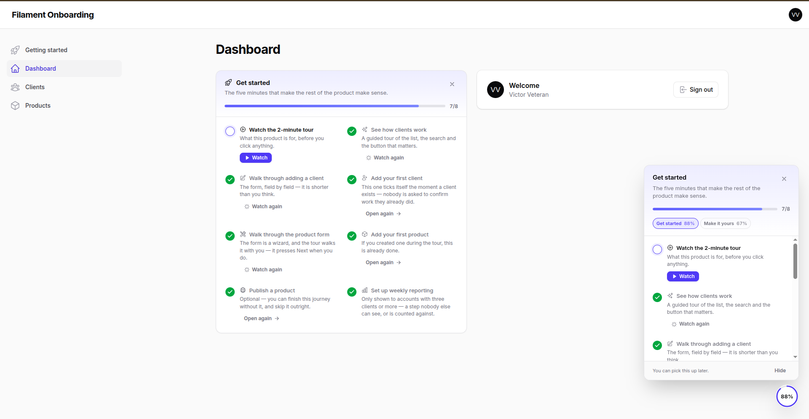

<details>
<summary><b>📸 More screenshots</b> — the welcome screen, the progress page, a tour, the video modal, and the side nobody has to write code on</summary>

<br>

| The welcome screen | The progress page |
|:---:|:---:|
| 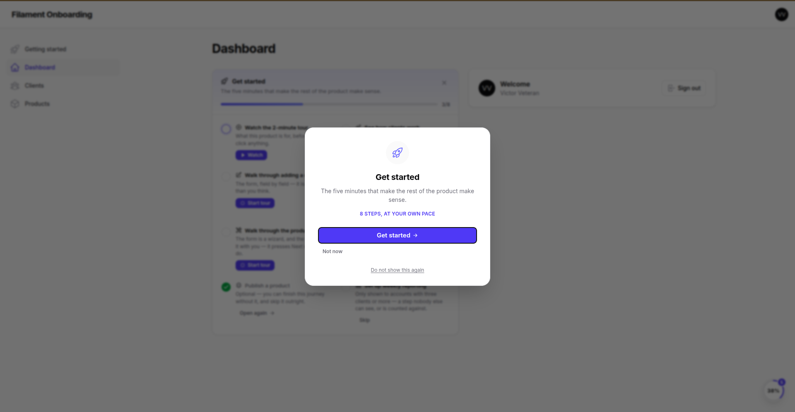 | 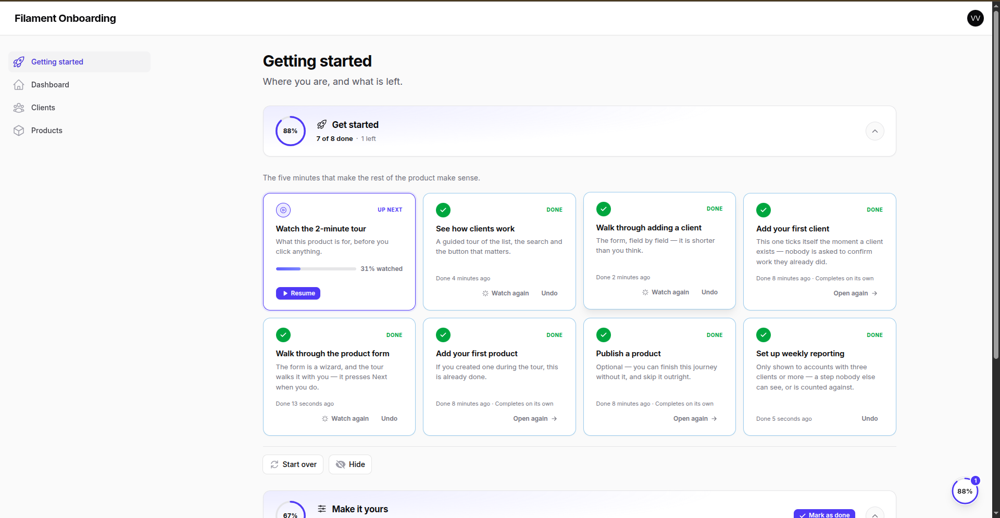 |
| One moment to introduce itself, and three honest answers. | Where you are, and what is left. |

| A guided tour | A video, docked in a corner |
|:---:|:---:|
| 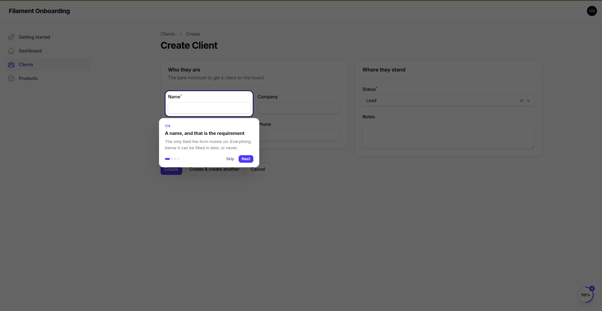 | 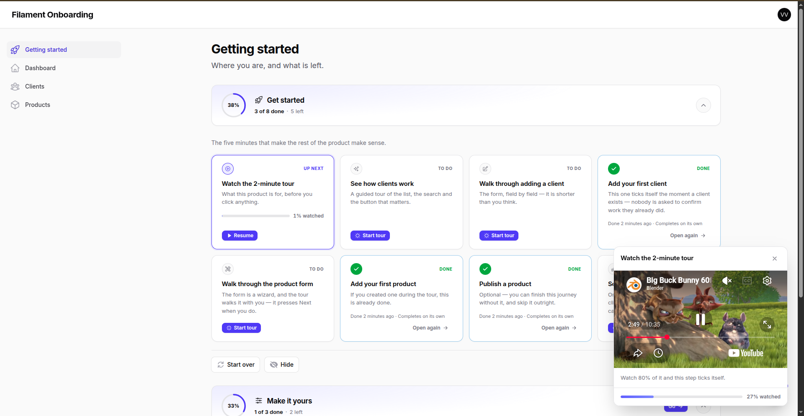 |
| Spotlights the field, explains it, moves on. | The page stays usable behind it — and the watching is measured. |

| Steps, written in the panel | Conditions, written in the panel |
|:---:|:---:|
| 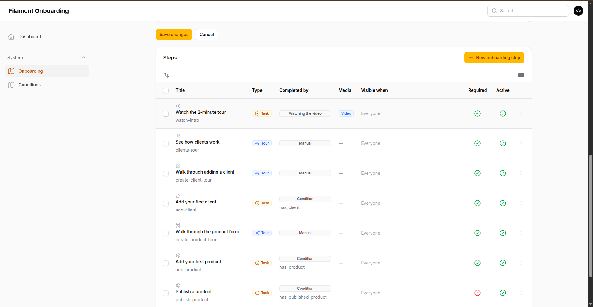 | 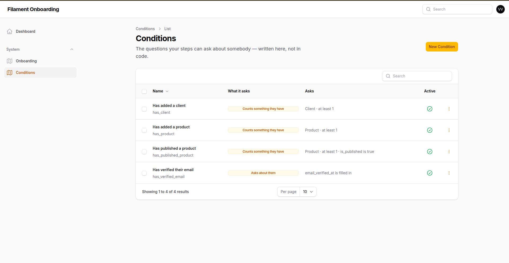 |
| Five ways for a step to finish. Three of them tick themselves. | *"Have they added a client yet?"* — a form, not a commit. |

</details>

## Features

- 🚀 **Welcome screen** — greets the user once, with "get started", "not now" and "don't show this again"
- ✅ **Floating checklist** — a progress button on every page of the panel, with tabs when there is more than one journey
- 🧭 **Guided spotlight tours** — cross pages, walk through wizards, and wait for the form instead of pointing at nothing
- 🖊️ **Authored in the panel** — flows, steps **and the conditions they hang off** are database records with a full admin resource; a new journey is not a deploy
- 🪄 **Five completion modes** — by hand, by a **condition** (retroactively), by **visiting a page**, by **watching a video**, or from your own code
- 🧩 **Conditions without code** — "has at least one client, that is active" is a form, not a commit; and `make:onboarding-condition` covers the questions a form cannot ask, with nothing to register
- 👁️ **Visibility conditions** — gate a journey, a step or a single tour stop on a plan or a feature flag
- 🎬 **Images & videos** — upload (S3, R2, local), direct URL, YouTube or Vimeo; **watch time is measured**, not guessed
- 📊 **Progress page & dashboard widget** — the journey laid out in cards, and the checklist as a card
- 🎯 **Panel discovery** — destinations, pages and widgets picked from dropdowns built out of your own panel; nobody types a URL
- 🌍 **Any locale** — content stored per locale and read back in the reader's, with a fallback chain
- 🏢 **Multi-tenant** — progress is scoped, so the same user onboards separately in each tenant
- 🔔 **Events & a fluent API** — `StepCompleted` / `FlowCompleted`, and `Onboarding::for($user)` for everything else
- 🎨 **Yours to style** — CSS variables, a replaceable stylesheet, publishable views
- 🔒 **Server-side guards** — every browser-reachable action re-checks what the interface checked

## Requirements

- PHP 8.2+
- Laravel 12+
- Filament 5.0+
- PostgreSQL or MySQL/MariaDB

| Package | Filament |
|---|---|
| `^2.1` | v5 |
| `^1.0` | v4 (planned) |

> **2.0.0 is withdrawn** — it lets any authenticated user complete any onboarding step, and
> a condition that throws returns a 500 on every page of the panel. Require `^2.1` (Composer
> resolves it to 2.2+, whose migration survives the duplicate rows 2.0.0 could write).

> Maintaining or extending the package? Read **[ARCHITECTURE.md](ARCHITECTURE.md)** — the data model, panel discovery, the tour runner, the player, asset versioning, and the traps that will bite you if you "clean up" the wrong line.

## Table of contents

- [Quick start](#quick-start)
- [Writing a journey](#writing-a-journey)
- [How a step is completed](#how-a-step-is-completed) · [conditions](#conditions) · [visibility](#visibility-not-every-journey-is-for-everybody)
- [Panel discovery](#panel-discovery)
- [Tours](#tours) · [a "view the tutorial" button](#a-view-the-tutorial-button-on-the-page-itself) · [wizards](#tours-that-walk-through-a-wizard)
- [Images and videos](#images-and-videos)
- [Where onboarding shows up](#where-onboarding-shows-up) · [welcome](#the-welcome-screen) · [checklist](#the-floating-checklist) · [widget](#the-dashboard-widget) · [progress page](#the-progress-page)
- [Programmatic API](#programmatic-api)
- [Who onboards, and in what context](#who-onboards-and-in-what-context)
- [Locales](#locales)
- [Making it look like your product](#making-it-look-like-your-product)
- [Configuration](#configuration)
- [Upgrading](#upgrading)

---

## Quick start

```bash
composer require wallacemartinss/filament-onboarding:^2.1

php artisan vendor:publish --tag=filament-onboarding-migrations
php artisan vendor:publish --tag=filament-onboarding-config
php artisan migrate
php artisan filament:assets
```

Register the plugin on the panel your users are onboarded in:

```php
use Wallacemartinss\FilamentOnboarding\FilamentOnboardingPlugin;

$panel->plugins([
    FilamentOnboardingPlugin::make()
        ->launcher()                        // floating checklist, on every page
        ->tours()                           // guided tours
        ->progressPage()                    // optional page laying the journey out
        ->launcherPosition('bottom-right')  // bottom-left, top-right, top-left
        ->modalPosition('center'),          // where images and videos open
]);
```

And on the panel where journeys are written — usually an admin panel:

```php
FilamentOnboardingPlugin::make()
    ->manageFlows()
    ->launcher(false)
    ->tours(false)
    ->navigationGroup(fn (): string => __('navigation.system'))
    ->navigationIcon('heroicon-o-map')
    ->navigationSort(70),
```

`->manageFlows()` is what puts the two resources in the menu — the journeys, and the questions they hang off:

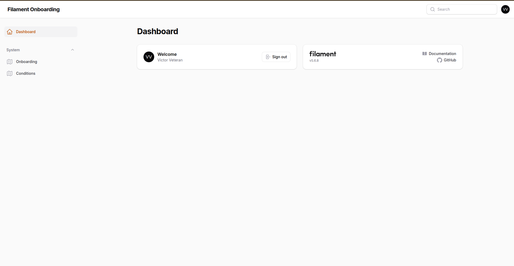

That is the whole install. Create a journey in the panel, add its steps, and it shows up — **including the steps that complete themselves**. Nothing here needs a deploy.

### Publishing

| Tag | What it gives you |
|-----|-------------------|
| `filament-onboarding-config` | `config/filament-onboarding.php` |
| `filament-onboarding-migrations` | the five tables, and the columns later releases added |
| `filament-onboarding-views` | every Blade view — checklist, launcher, tour popover, media modal, progress page |
| `filament-onboarding-translations` | the UI strings, per locale |
| `filament-onboarding-styles` | the stylesheet, to restyle without forking |

> Publishing **views** or **translations** takes them over: from then on your copies win, and updates to the package no longer reach those files. Publish them when you mean to own them.

Assets (CSS and the Alpine components) are served by Filament from `public/`, so run `php artisan filament:assets` after installing and after upgrading. They are versioned by **content hash**, so a changed file always reaches the browser — no cache-busting on your side.

---

## Writing a journey

A journey is a row. Its steps are rows. The questions those steps hang off are rows. Which means the person who knows what a new user needs to learn can write it, change it, reorder it and retire it — without ever asking for a deploy.

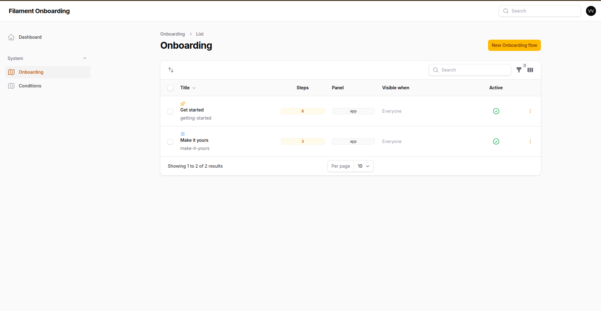

A flow says who it is for and where it lives: the **panel** it belongs to (empty means all of them), the condition that decides who **sees** it, its place in the order, and whether the user is allowed to hide it for good. Text is written once per locale, so the same journey reads in Portuguese and in English.

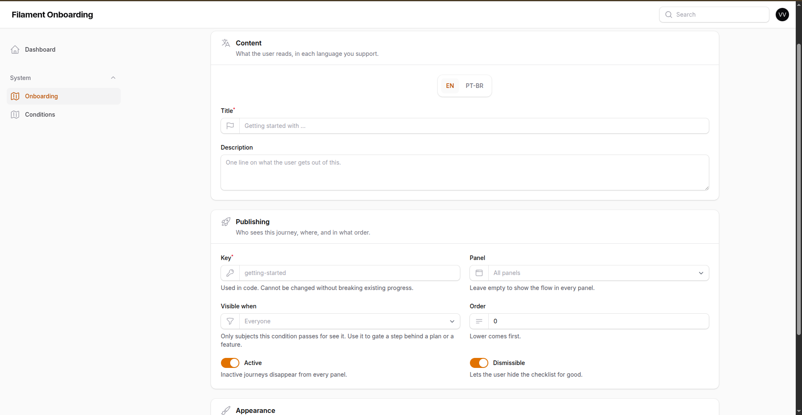

> The **key** is the one field that cannot change afterwards — it is what every progress row points at, and renaming it orphans them. Everything else is yours to rewrite whenever the product does.

Steps are written inside the flow — and that is where a checklist turns into onboarding, because of the one field that comes next.

---

## How a step is completed

Every step declares how it finishes, and the checklist behaves accordingly — a step the user cannot tick off themselves is offered as a link, not as a checkbox.


The **Completed by** column is this whole section. Of the steps above, three wait for the user to tick them off, three are watching the database and will tick themselves, and one is measuring how much of a video got watched.

| Mode | Finishes when |
|------|---------------|
| **Manual** | The user ticks it off. |
| **Condition** | A named question about the user passes — *including retroactively*. |
| **Page visit** | The user reaches a URL (`*` wildcards allowed). |
| **Watching the video** | Enough of the step's video has been watched (90% by default). |
| **Programmatic** | Your code calls `Onboarding::for($user)->complete('key')`. |

### Conditions

A condition is a question about the user — *"have they added a client yet?"* — and it is what makes a step complete itself, including for people who did the thing long before the journey existed. It is picked from a dropdown when the step is written.

**Most of them are written in the panel, not in code.** Onboarding → Conditions → New:


Two shapes cover nearly everything. **Counts something they have** — *a Product, at least one of them, and only the ones where `is_published` is true*. **Asks about them** — *`email_verified_at` is filled in*. Both are the same form, and the step editor lists them by name.

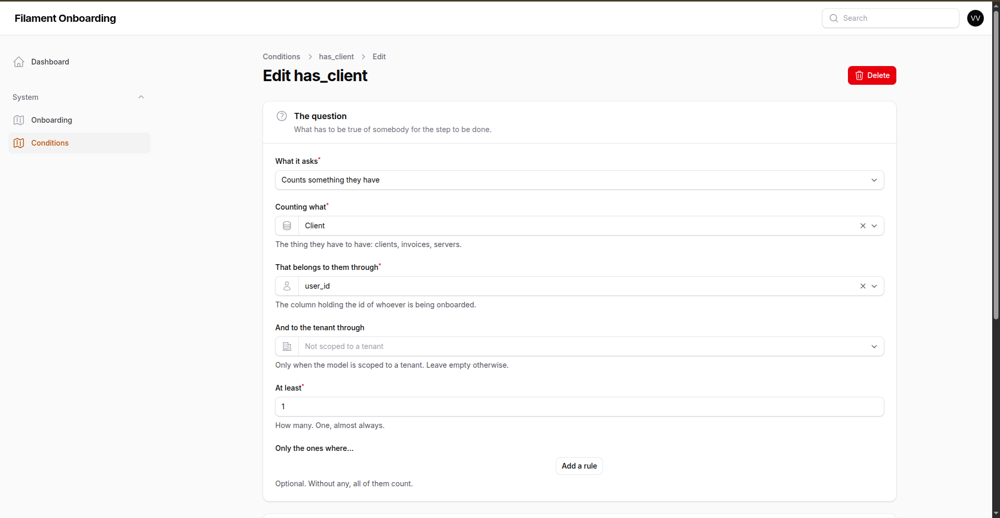

The author never types a table name, a column or an operator. The model comes from an allowlist you control, the column from that table's real columns, the operator from a list — and the value they do type is **bound, never interpolated into SQL**. What they are really being asked is *how does this thing know it belongs to the person being onboarded* — the `user_id` above — and that is a question a product person can answer.

**For a question a form cannot ask** — an active subscription over at Stripe, a score from a service — write a class:

```bash
php artisan make:onboarding-condition HasActivePlan
```

```php
// app/Onboarding/Conditions/HasActivePlanCondition.php — answers to `has_active_plan`
class HasActivePlanCondition implements OnboardingCondition, HasConditionLabel
{
    public static function label(): string
    {
        return __('Has an active plan');   // what the step editor shows
    }

    public function isCompleted(Model $subject, ?Model $scope = null): bool
    {
        return $subject->subscription()?->active() ?? false;
    }
}
```

**There is nothing to register.** Anything in `app/Onboarding/Conditions` is found on its own and is in the dropdown — writing the class and then naming it in a config file would be saying the same thing twice, and the second half is the half that gets forgotten in the deploy where it matters.

You can still register one by hand, for a condition that lives elsewhere or ships in a package of your own:

```php
Onboarding::condition('has_server', fn (User $user, ?Tenant $tenant): bool =>
    $tenant->servers()->exists()
);
```

Code always wins a name clash: a condition written in the panel cannot take a key a class already answers to, so a row can never quietly redefine what a step means.

Conditions are evaluated only for pending steps, and the result is persisted the first time it passes — so an established account opens the checklist and finds its history already reflected there. A condition that is no longer registered never completes a step, and one that throws answers "no" and is reported: it goes quiet instead of taking the panel down with it.

### Visibility: not every journey is for everybody

The same conditions decide who a flow, a step or a single tour stop is *for*. Pick one under **Visibility** and what it guards only exists for subjects the condition passes for.

This is how you gate onboarding on a plan. If Docker is not part of the free plan, the panel does not render the Docker card — and a tour stop pointing at it would spotlight empty space and advertise something the account cannot buy into. Guard the stop with `has_docker_feature` and the subject is walked from the traditional mode straight to the next stop, as if the Docker stop had never been written.

```php
Onboarding::condition('has_docker_feature', fn (User $user, ?Tenant $tenant): bool =>
    $tenant?->hasFeature('docker_services') ?? false
);
```

Three things follow from it, and they are deliberate:

- A hidden step is **not pending** — it is left out of the count, so the percentage is of the journey the subject can actually walk, and they can reach 100% without it.
- A condition that is **not registered hides** what it guards. If the application cannot answer "is Docker on this plan?", teaching Docker is the wrong default.
- A flow whose every step is hidden **is not shown at all**, rather than as a card at 0% that can never be finished.

Visibility and completion are different questions asked of the same registry: `has_docker_feature` decides *whether you see the step*, `has_server` decides *whether the step is done*. A step can use both.

---

## Panel discovery

Nobody types a URL. When a step or a tour stop needs a destination, the dropdown is built from the panel itself:

- **Resources** — every list and create page, labelled the way the panel labels them. Pages that need a record (edit, view) are left out, since onboarding has no record to hand them.
- **Pages** — every custom page, by its navigation label.
- **Widgets** — every widget of the panel, including the ones attached to a page rather than registered on it.

What gets stored is the **route name**, not the URL, so renaming a resource slug does not break a journey, and `{tenant}` is filled in at render time.

---

## Tours

A tour spotlights one element at a time, explains it, and moves on. It can cross pages: give a stop a page and the runner navigates there and carries on.

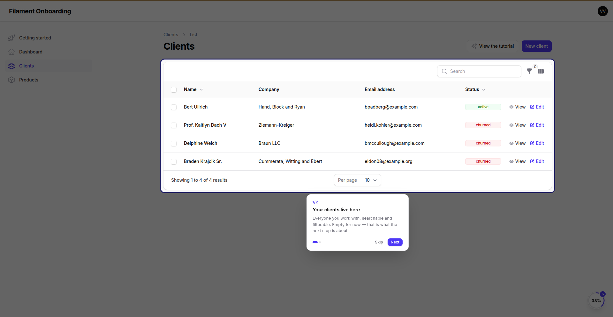

The page dims, the thing being talked about does not, and the popover finds a corner near it. The user can still type in the form underneath — a tour is a guide, not a modal.

### What a stop points at is picked, not typed

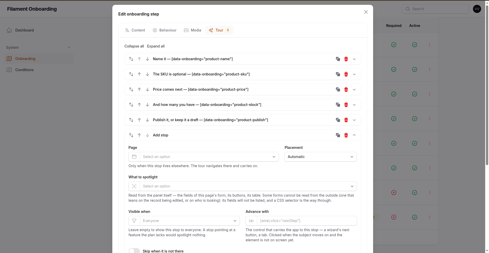

Pick the **page** the stop lives on, and the package reads that page out of your panel:

| Pick this | And it finds |
|---|---|
| **Status** | the field, label and all — every field of the form, by the label it wears. A `Select` and a `Toggle` too. |
| **The save button** | the one that submits, on a create page and an edit one. |
| **The table** · **The search box** | on any list page. |
| **Column: Status** | the column, by the heading it carries. |
| **The "New client" button** | it is a link to the create page, and the package has the route. |
| **A widget** | any widget of the panel. |
| **A CSS selector of my own…** | for anything the panel cannot name. |

Nobody has to know CSS, and nobody has to know that a developer went and put a hook in the code. What gets stored is the **choice** (`field:status`), not the selector — same reason a route name is stored and not a URL: the markup underneath is Filament's to change, and a journey should survive it changing.

<details>
<summary>📸 <b>A tour with no CSS in it at all</b> — four stops, picked from the dropdowns above</summary>

<br>

Written as `field:name`, `field:status` and `action:submit`, on the create page of a resource. Nothing was added to the application to make this work — no `data-onboarding` attribute, no hook, no deploy.

| The field the form insists on | The one that means something |
|:---:|:---:|
|  | 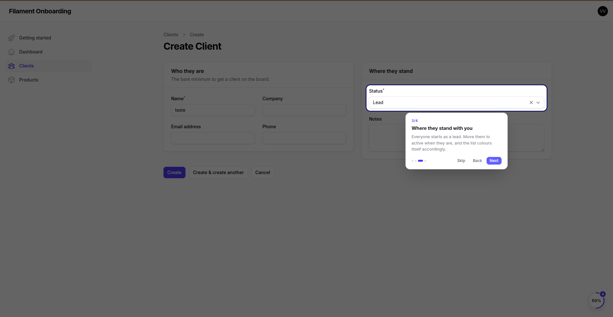 |
| `field:name` — a `TextInput`. | `field:status` — a `Select`, in the section next door. Note the name already typed in: the form kept working while the tour ran. |

| The button that saves | |
|:---:|:---:|
| 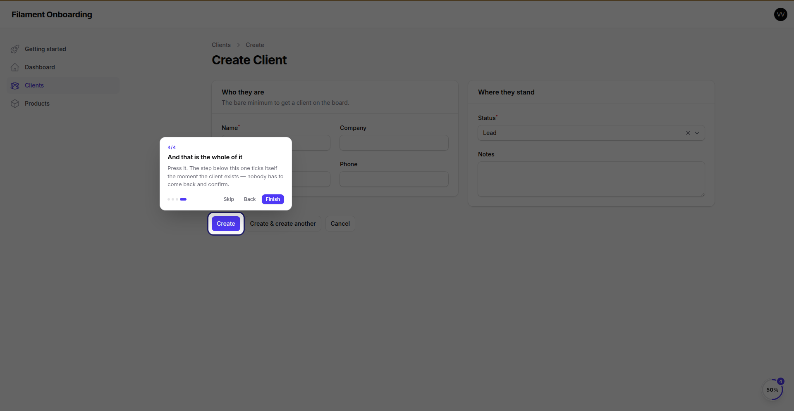 | 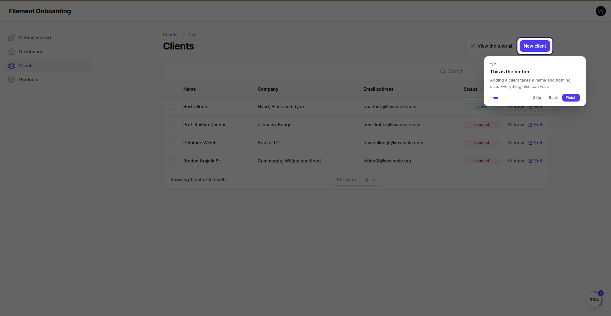 |
| `action:submit` — found on a create page and on an edit one alike. | And on a list page, **the "New client" button** is offered by name: it is a link, and the package knows the route it points at. |

</details>

> **A form that cannot be read gives up its fields, and nothing else.** Forms are built to be *rendered*, and one that leans on the record being edited, or on who is looking, will not survive being asked what is in it outside of a request. Its fields simply are not listed — the panel does not fall over, and the CSS box is right there.

### When you write the selector yourself

For anything the panel cannot name — a particular card, a paragraph, a third-party widget's insides — a stable hook on the thing you own is cheapest:

```php
Action::make('create')->extraAttributes(['data-onboarding' => 'create-server']),
```

And two selectors the package understands that CSS does not:

```
@widget:App\Filament\...\StatsWidget     a widget, by the component it is
@livewire:edit_password_form             any Livewire component, by name
```

The last one matters more than it looks. A form section rendered by a third-party plugin has no hook of its own, and **Filament builds a section's id from its heading — which is translated**. Anchoring to `#form.update-password::section` gives you a tour that works in English and silently spotlights nothing in Portuguese. Addressing the component sidesteps that entirely.

A selector that no longer matches does not break the tour: the page dims and the popover is centred, so the copy still reads.

Tours report the stop the user reached, so a tour abandoned half-way shows as half-way — and can be resumed.

Finishing a tour completes its step only when the step's completion mode is **Manual** — for a manual step, the tour *is* the task. A tour attached to a step that finishes by a condition, a visit, a video or your own code records that it was watched and leaves completion to the mode: clicking "next" to the end is not proof that two-factor got enabled.

### A "view the tutorial" button on the page itself

The launcher starts tours from the checklist. For the pages that deserve their own invitation, drop a header action on them:

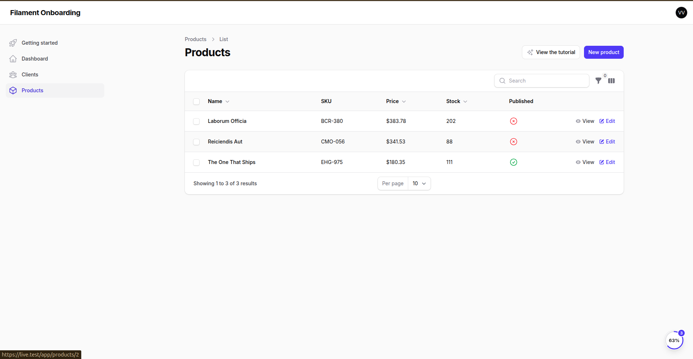

```php
use Wallacemartinss\FilamentOnboarding\Actions\StartTourAction;

protected function getHeaderActions(): array
{
    return [
        StartTourAction::make('servers-tour'),
        Actions\CreateAction::make(),
    ];
}
```

**A screen can be walked more than one way.** A server is created *with* a provider, or by bringing one you already own — two tours, one button. Hand it several keys and it asks which, naming each by its own title, so nobody has to guess what is behind a button:

```php
StartTourAction::make([
    'servers-tour',
    'create-server-cloud-tour',
    'create-server-byos-tour',
]),
```

With one tour there is nothing to ask, and it starts outright. Only tours the subject can actually take are offered — an unknown key, a step with no tour, or one hidden by a visibility condition is left out, and when none survive the button is not there at all. A plan that cannot see the journey never sees the invitation.

### Tours that walk through a wizard

The field a stop points at often does not exist yet: it lives on the next step of a wizard, or inside a section that is still closed. The tour handles both directions, without ever taking the mouse away from the user.

**The tour follows the user.** Advance the wizard and the tour advances with you — it watches the page, and when the element of a later stop shows up, that is where it goes.

**The tour brings the app along.** Give a stop an **"Advance with"** selector — the control that gets the application there — and pressing *Next* on the tour presses it:

```
[wire\:click="nextStep"]      the wizard's own next button
```

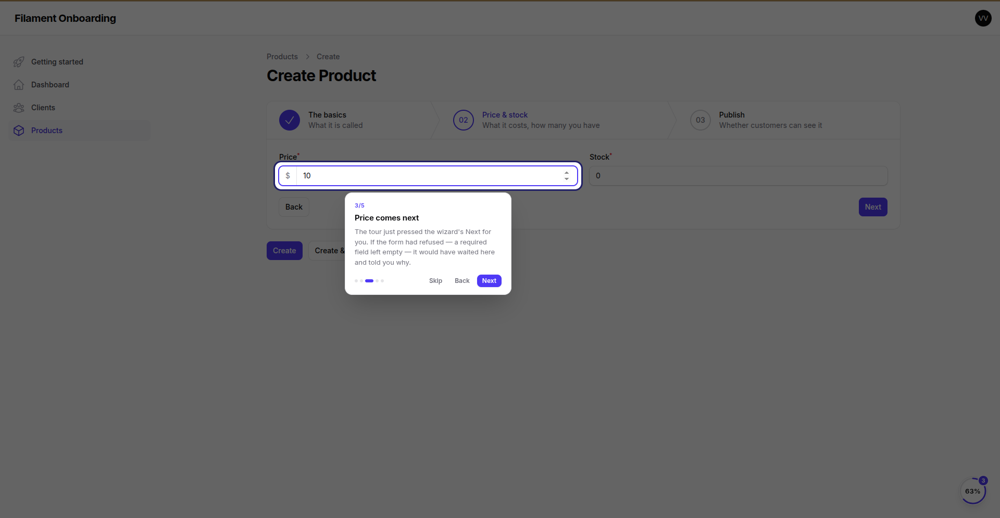

It is clicked only when the user moves on and the element is not on screen — and it is a **real press** (`mousedown`, `mouseup`, `click`), because plenty of things do not listen for a bare click: a Filament dropdown, for one, opens on `mousedown`. If the application refuses (a required field is empty), the tour waits and says so, rather than pointing at nothing.

<details>
<summary>📸 <b>Five stops across three wizard steps</b> — the user only ever pressed <i>Next</i> on the tour</summary>

<br>

| 1 · Name | 2 · SKU |
|:---:|:---:|
| 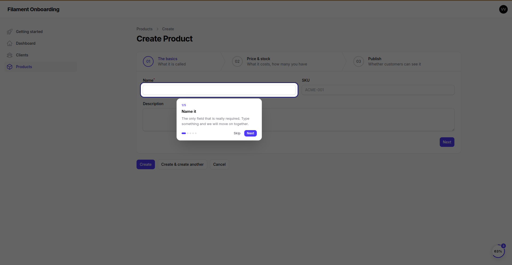 | 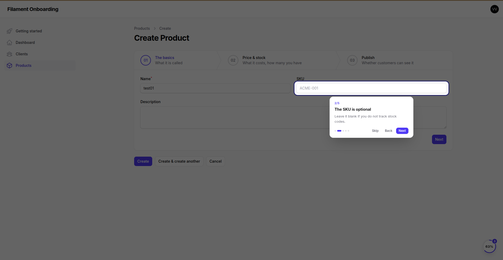 |
| Wizard step **01**. | Still **01** — the tour has no reason to move the app yet. |

| 3 · Price | 4 · Stock |
|:---:|:---:|
|  | 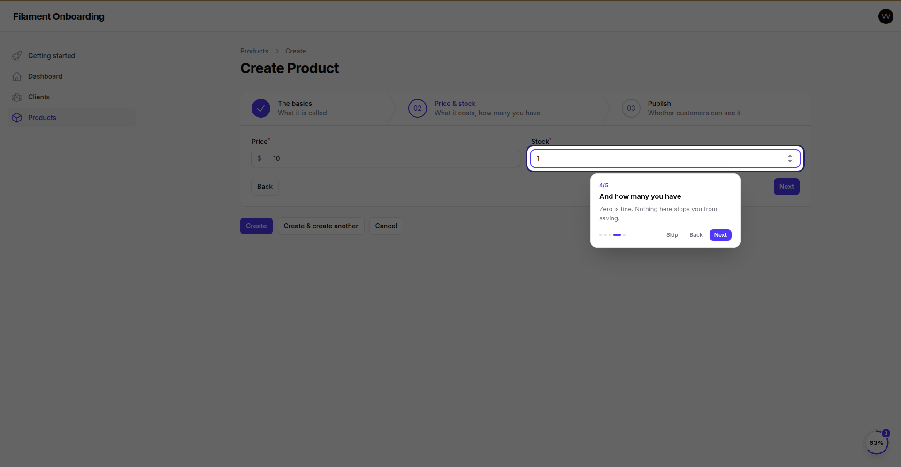 |
| Wizard step **02** — the field was not on screen, so the tour pressed the wizard's own *Next* to get to it. | Still **02**. |

| 5 · Published | |
|:---:|:---:|
| 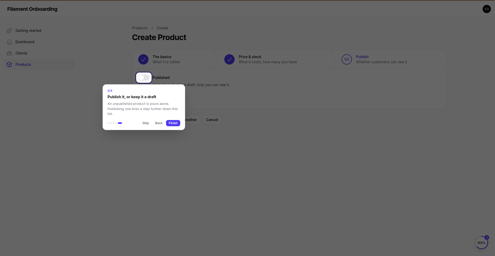 | |
| Wizard step **03**, reached the same way. A `Toggle` is a field like any other. | |

</details>

**Skip when it is not there.** Some stops are about something an account may not have yet — a tag on an empty table, a chart with no data. Mark the stop **optional** and the tour steps aside instead of waiting for something that is never coming.

---

## Images and videos

A step can carry an image to show or a video to watch. Both open in a modal over the panel, from the checklist, the widget or the progress page.


**Images** are uploaded to the configured disk or addressed by URL, and show as a thumbnail on the step.

**Videos** come from an upload, a direct `.mp4`, YouTube or Vimeo — paste the link however it came, the id is dug out of watch, share and shorts URLs alike. Any other provider can be embedded in an iframe.

```php
// config/filament-onboarding.php
'media' => [
    'disk'       => env('FILESYSTEM_DISK', 's3'),   // S3, R2, local — any Laravel disk
    'directory'  => 'onboarding',
    'visibility' => 'private',                      // signs a temporary URL instead of exposing the file
    'url_ttl'    => 30,
],
```

A **private disk is signed at render time**, so a bucket kept closed stays closed.

> The signing decision reads `media.visibility` here, or `'visibility' => 'private'` on the
> disk in `config/filesystems.php`. A bucket that is private *on AWS* but says nothing in the
> config gets a plain URL — which the bucket then refuses. If the files are private, say so
> in one of those two places.

### Watch time is real

The player reports where the subject actually is — the `<video>` element for a file, the IFrame API for YouTube, the SDK for Vimeo — every few seconds and once more on the way out. What is kept is the **furthest point reached**, so rewinding to rewatch does not undo the ground covered, and the video resumes where it stopped.

That makes the **Watching the video** completion mode possible: set the threshold (90% by default, since nobody sits through the credits) and the step completes itself when the subject gets there. Until then the card shows the partial percentage.

An iframe embed from an unknown provider cannot be measured, so nothing is invented about it: the video plays, and the step completes some other way.

### Where the modal opens

Centred by default. Docked in a corner, it leaves the page usable behind it — the point when the video is something to follow along with.

```php
FilamentOnboardingPlugin::make()->modalPosition('bottom-right'),
```

`center`, `top`, `bottom`, `top-left`, `top-right`, `bottom-left`, `bottom-right`. Any step may override the panel's choice.

---

## Where onboarding shows up

Three surfaces, all optional, all reading the same progress — tick a step off in one and the others update behind it.

### The welcome screen

```php
FilamentOnboardingPlugin::make()->welcome(),
```


A checklist in the corner is easy to never notice, so onboarding gets one moment to introduce itself: the first page after logging in. It names the journey, says how many steps it is, and offers three answers —

- **Get started** → the progress page (or the checklist, when the panel has no progress page).
- **Not now** → gone for this session. Nothing is written down: "later" is an answer about *now*, and the next login is a new now.
- **Do not show this again** → gone for good. **The floating button and the ring go with it** — hiding the welcome but leaving the badge blinking in the corner would be answering a different question than the one they were asked.

It is never a dead end: the progress page stays in the menu, and it offers onboarding back. Tours keep working either way — a "view the tutorial" button is something the user reaches for, not something that reaches for them.

> Look at the ring in the corner of that screenshot: **38%, on an account that has never seen this journey**. It is an old account, and it already has clients and a published product — so three of the eight steps were true before the journey was written, and the user is greeted with credit for work they had already done rather than a to-do list of things they finished last year. That is what a condition-backed step buys you, and it is the reason to reach for this package over a checklist you hardcode.

### The floating checklist

`->launcher()` puts a progress button on every page of the panel — pages, resources, widgets alike, since it hangs off the body. With more than one journey, the panel shows tabs, so a finished journey never sits in front of an unfinished one.


### The dashboard widget

```php
use Wallacemartinss\FilamentOnboarding\Widgets\OnboardingChecklistWidget;

// In a Dashboard page, or the panel's widgets()
OnboardingChecklistWidget::class,
```

The same checklist, as a card on the page — it is the panel on the left of the screenshot above, sitting next to the floating one. It hides itself once the journey is finished or dismissed.

### The progress page

The journey laid out in cards: a ring with the percentage, counters for done / left / skipped, the next step highlighted with its call to action, and a card per step showing its state and what to do about it.


Every card says what it is waiting for, and finished ones say how they finished — *"Done 8 minutes ago · Completes on its own"* is a step nobody was asked to tick. The last one there, **"Set up weekly reporting"**, is only shown to accounts with three clients or more: a step gated by a [visibility condition](#visibility-not-every-journey-is-for-everybody) is not counted against the people who never see it.

```php
FilamentOnboardingPlugin::make()
    ->progressPage()
    ->progressPageSlug('getting-started')        // default: onboarding
    ->progressPageNavigation(
        label: fn (): string => __('Getting started'),
        icon: 'heroicon-o-map',
        group: fn (): string => __('Settings'),
        sort: 90,
    ),
```

`->progressPage(shouldRegisterNavigation: false)` keeps the page reachable by URL but out of the menu. The page also removes itself from the navigation once a user has no journey left.

**Finished is not the same as done with it.** A completed step still offers "watch again", "replay the video", "open again" — none of which undoes anything. Undo is offered separately, and never on a step bound to a condition: unticking it would be undone by the next render, because what it asks about is still true.

**Start over** clears what the user did — ticks, skips, tours and videos watched. It cannot clear what is simply true, so steps bound to conditions come straight back, and the page says so rather than looking broken.

---

## Programmatic API

```php
use Wallacemartinss\FilamentOnboarding\Facades\Onboarding;

$onboarding = Onboarding::for($user, $tenant);   // or Onboarding::current()

$onboarding->complete('first-deploy');
$onboarding->skip('invite-team');
$onboarding->uncomplete('first-deploy');
$onboarding->dismiss('getting-started');
$onboarding->restore('getting-started');
$onboarding->reset('getting-started');
$onboarding->handleVisit('/app/acme/servers/create');

$flow = $onboarding->flow('getting-started');      // or ->currentFlow()

$flow->percentage();            // 43
$flow->isCompleted();
$flow->nextStep()?->title();
$flow->steps;                   // StepState[]
```

`StepState` answers what the UI needs: `isCompleted()`, `isSkipped()`, `isPending()`, `percentage()`, `canReplay()`, `canUndo()`, `url()`, `tour()`, `media()`, `videoProgress()`, `tourProgress()`.

### Events

```php
use Wallacemartinss\FilamentOnboarding\Events\{StepCompleted, FlowCompleted};
```

Both carry the step/flow, the progress row, the subject and the scope — enough to award a credit, send an email, or ping a channel when somebody finishes onboarding.

### Command

```bash
php artisan onboarding:reset getting-started --subject=1 --scope=<tenant-id> --scope-model="App\Models\Tenant"
```

Wipes a subject's progress through a journey. Handy while writing one. Steps bound to a condition come straight back — the command says so.

---

## Who onboards, and in what context

By default the subject is the authenticated user and the scope is the current Filament tenant. Override either:

```php
FilamentOnboardingPlugin::make()
    ->subject(fn () => auth()->user())
    ->scope(fn () => Filament::getTenant())
    ->urlParameters(fn (): array => ['tenant' => Filament::getTenant()?->slug]),
```

`urlParameters` fills `{placeholders}` in step URLs, so a step written as `/app/{tenant}/servers/create` lands on the right tenant.

---

## Locales

List the locales you write content in:

```php
'locales' => ['pt_BR', 'en', 'es'],
```

The panel then shows one tab per locale for every piece of text. At render time the package reads `app()->getLocale()` and falls back — exact locale, then the base language (`pt_BR` → `pt`), then the app fallback, then whatever is filled in. A user reading in Spanish sees Spanish; a user in a locale nobody wrote for still sees a usable checklist.

A plain string is treated as a translation key, so a journey can point at your own language files instead:

```php
'title' => 'onboarding.journey.title',   // resolved through __()
```

---

## Making it look like your product

Three levels, cheapest first.

**1. Retheme with variables.** The stylesheet reads an override for every value it uses, so declaring these anywhere in your own CSS wins regardless of load order:

```css
:root {
    --fio-theme-accent: var(--color-brand-600);
    --fio-theme-accent-dark: var(--color-brand-400);
    --fio-theme-radius: 1rem;
    --fio-theme-panel-width: 24rem;
}
```

Available: `--fio-theme-{accent,accent-soft,success,surface,surface-muted,border,text,text-muted,shadow,shadow-lg,radius,radius-sm,panel-width}`, each with a `-dark` counterpart.

**2. Replace the stylesheet.**

```bash
php artisan vendor:publish --tag=filament-onboarding-styles
```

```php
'styles' => [
    'enabled' => true,
    'path'    => resource_path('css/vendor/filament-onboarding/onboarding.css'),
],
```

Then `php artisan filament:assets`. Set `enabled => false` and no stylesheet ships at all — the markup keeps its `.fio-*` classes for you to dress from your own panel theme.

**3. Replace the markup.**

```bash
php artisan vendor:publish --tag=filament-onboarding-views
```

The Livewire components keep working: they only call `completeStep`, `skipStep`, `startTour`, `openMedia`, `dismissFlow`, `restartFlow`.

### Icons

The icon field takes any Blade icon name — `heroicon-o-server`, `phosphor-rocket`. Add [`wallacemartinss/filament-icon-picker`](https://github.com/wallacemartinss/filament-icon-picker) and the field becomes a visual picker on its own; the package detects it and needs no configuration. Without it, the field stays a text input and everything else works the same.

---

## Configuration

`config/filament-onboarding.php`, in full:

| Key | What it does |
|-----|--------------|
| `locales` | Locales offered when writing content. |
| `fallback_locale` | Used when the reader's locale has no content. Defaults to the app fallback. |
| `conditions` | Conditions registered by hand. Most need nothing here — they are written in the panel, or found in `app/Onboarding/Conditions`. |
| `discovery` | Where condition classes are found. |
| `conditions_builder` | Which models a condition may be built over in the panel (an allowlist; empty offers `app/Models`). |
| `cache` | Journey **definitions** are cached and flushed on write. Progress is never cached. |
| `media` | Disk, directory, visibility, signed-URL TTL, accepted types and size limits. |
| `modal` | Default position of the media modal. |
| `styles` | Ship the stylesheet, replace it, or turn it off. |
| `tables` / `models` | Rename the tables, or swap the models for your own. |
| `resource` | Navigation of the flow resource, when the plugin does not set it. |

---

## Upgrading

New versions can ship new migrations and new assets:

```bash
composer update wallacemartinss/filament-onboarding
php artisan vendor:publish --tag=filament-onboarding-migrations   # existing files are left alone
php artisan migrate
php artisan filament:assets
```

---

## Development

```bash
composer install
npm install && npm run build   # builds the Alpine components and copies the CSS into resources/dist
vendor/bin/pint
vendor/bin/phpunit
```

## License

MIT. See [LICENSE.md](LICENSE.md).
